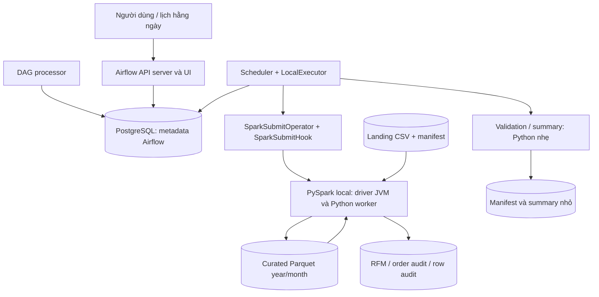
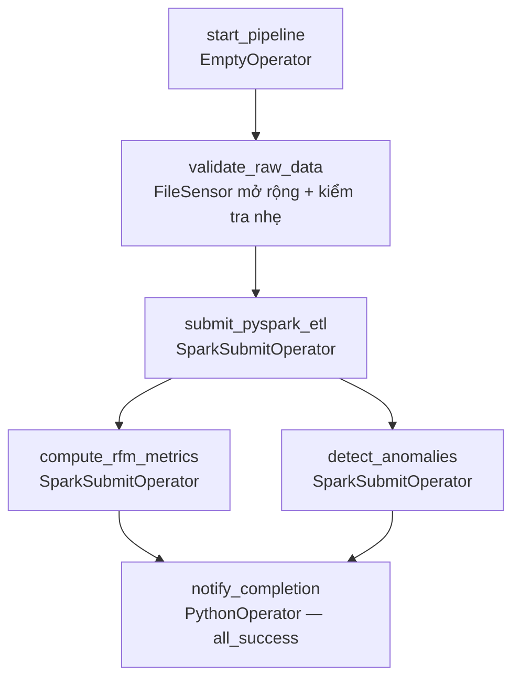

# Thiết kế DAG bán lẻ: Airflow điều phối, PySpark xử lý

Ngày thiết kế: 28/09/2026. DAG chính thức đã được triển khai; xem [kết quả triển khai](IMPLEMENTATION_VI.md) để phân biệt phần đã kiểm chứng và phần còn giới hạn. Các mục dưới giữ lý do lựa chọn và kế hoạch nghiệm thu để truy vết.

Tài liệu dựa trên `airflow_subject.docx`, sách *Data Pipelines with Apache Airflow — Orchestration for Data and AI, Second Edition* của Julian de Ruiter, Ismael Cabral, Kris Geusebroek, Daniel van der Ende và Bas Harenslak, cùng code hiện tại của repository. Sách là căn cứ về kỹ thuật điều phối; các ngưỡng kinh doanh và cấu hình tài nguyên dưới đây là lựa chọn của project, không gán cho tác giả sách.

Trong bản PDF người dùng cung cấp, **trang PDF = trang in + 28** đối với các trang nội dung được dẫn. Ví dụ `[B3] tr. 57` là trang 85 trong trình đọc PDF. Danh mục tài liệu và bảng tra trang nằm ở mục 19.

## 1. Phạm vi và điều kiện để gọi là hoàn thành

### 1.1 Kết quả cần giao

Mỗi ngày, hệ thống kiểm tra dữ liệu nguồn, tạo dữ liệu sạch, tính RFM/phân nhóm/nguy cơ không hoạt động và kiểm tra bất thường của đơn hàng. Kết quả có ngày phân tích, nguồn dữ liệu, phiên bản quy tắc, số lượng bản ghi và trạng thái kiểm tra chất lượng. Airflow phải thể hiện đúng thành công/thất bại; chạy lại phải an toàn.

Chọn **UCI Online Retail qua Kaggle `carrie1/ecommerce-data`**. Kiểm tra CSV tại máy ngày 28/09/2026: 541.909 dòng, InvoiceDate từ `2010-12-01 08:26` đến `2011-12-09 12:50`, không có ngày trống trong bản CSV này. Đây là dữ liệu lịch sử một lần tải, không phải nguồn tự phát sinh giao dịch năm 2026.

Không đồng nhất ba mức bằng chứng:

1. Container `healthy`: hạ tầng chạy được.
2. Script Spark chạy độc lập và tạo `_SUCCESS`: một job ghi được kết quả.
3. DAG thật chạy qua scheduler, xử lý lỗi/retry/backfill đúng và đầu ra đạt kiểm tra: mới hoàn thành pipeline tự động.

### 1.2 Phạm vi theo rubric cập nhật

Người dùng đã cung cấp rubric mới ngày 28/09/2026, thay bảng chấm điểm mục 6 trong DOCX: Conceptual & Theoretical Depth 25; Airflow DAG Implementation 25; PySpark ETL & Analytics Jobs 25; Architecture, Setup & Reproducibility 15; Data Quality & Anomaly Detection 10. Tổng 100 điểm. Bảng mới là căn cứ chấm; mục 1–5 của DOCX tiếp tục là đặc tả chức năng.

Mâu thuẫn phạm vi đã được giải quyết: Kafka/Flume, streaming producer, recommendation và Cassandra trong rubric/hình minh họa cũ không thuộc yêu cầu của bản thiết kế này. Không cần chờ xác nhận lại. Mục 18 ánh xạ từng tiêu chí mới tới thiết kế, tests và bằng chứng cần nộp; việc được thiết kế bao phủ không đồng nghĩa đã đạt điểm triển khai.

### 1.3 Ma trận truy vết yêu cầu

| Mã | Yêu cầu trong đề | Quyết định và vị trí thiết kế | Bằng chứng nghiệm thu dự kiến |
|---|---|---|---|
| R01 | Giải thích DAG, task, operator, sensor, XCom, connection, hook | Mục 3 | Báo cáo + giải thích trực tiếp trên Graph/Grid |
| R02 | Orchestration khác compute; tránh pandas nặng trong PythonOperator | Mục 4, 7 | DAG không import Spark/pandas để xử lý; log có spark-submit |
| R03 | Môi trường tái lập | Mục 13 | Build image, version inventory, Compose healthy |
| R04 | Tự động hằng ngày; interval, retry, default args và SLA | Mục 5, 7, 12.4 | Timetable tests + scheduled DagRun + deadline alert evidence |
| R05 | `start_pipeline` dùng EmptyOperator | Mục 6–7 | Task đúng class và ID |
| R06 | `validate_raw_data`: Sensor, partition ngày và file > 0 byte | Mục 5.3, 7.2 | Đợi manifest; missing/zero-byte/header sai bị chặn trước Spark |
| R07 | `submit_pyspark_etl`: null CustomerID, Quantity/UnitPrice, timestamp | Mục 8 | Fixtures và reconciliation counters |
| R08 | Parquet phân vùng năm/tháng | Mục 8.3, 11 | Có `year=.../month=...`, đọc lại đúng schema |
| R09 | `compute_rfm_metrics`: aggregation + Window, rfm_daily | Mục 9 | R/F/M bằng fixture tính tay; điểm 1–5 |
| R10 | High-value, segmentation, churn risk | Mục 9.3–9.4 | Có nhãn giải thích được, không gán nghĩa tùy tiện cho Cluster |
| R11 | `detect_anomalies`: tổng đơn và ngưỡng thống kê | Mục 10 | Fixture cộng nhiều dòng thành đơn vượt ngưỡng |
| R12 | Audit ở `/data/audit/anomalies/` | Mục 10–11 | Có bảng đánh giá đơn và bảng đơn bị gắn cờ |
| R13 | Hai nhánh độc lập sau ETL, hội tụ thông báo | Mục 6, 12 | Graph đúng, thử hỏng từng nhánh |
| R14 | `notify_completion`: summary hoặc email khi thành công | Mục 7.6 | Summary có số liệu hai nhánh; không báo thành công khi nhánh hỏng |
| R15 | Idempotency, backfill | Mục 11–12 | Retry không nhân đôi; chạy ngày cũ không sửa ngày khác |
| R16 | REPORT, SETUP, code, tests, Git | Mục 16–17 | Checklist sản phẩm + revision được nộp |
| R17 | Thuyết trình/live demo | Mục 17 | Kịch bản thành công, lỗi, recovery, kết quả |
| R18 | Rubric mới 25/25/25/15/10 | Mục 18 | Checklist đủ 5 nhóm; Sensor/deadline/PEP8 có bằng chứng |

## 2. Đánh giá code hiện tại và khoảng cách cần bổ sung

| Thành phần | Hiện tại đã có | Cần thay đổi để đạt thiết kế |
|---|---|---|
| `dags/ecommerce_etl_dag.py` | Đúng tên 6 task và topology, tất cả là EmptyOperator | Operator thật, ngày/Params, pool, timeout, callback, summary |
| `pyspark_clean.py` | Schema cố định; dedup; tách RFM và audit; lọc hủy/giá trị không dương/phí dịch vụ | Landing theo ngày; checksum/manifest; parse lỗi; lọc finite/blank; year/month; publication an toàn |
| `pyspark_rfm.py` | R/F/M, percent_rank Window, KMeans, kiểm tra kết quả, ghi run_date | Nhãn business, inactivity/churn proxy, summary, input manifest và phiên bản đầu ra |
| `select_kmeans_k.py` | Phân tích k offline; `k_scores.csv` có kết quả k=2..10 | Chốt k có căn cứ, lưu provenance; không chạy chọn k trong DAG hằng ngày |
| `pyspark_anomalies.py` | 6 luật nghiệp vụ + 3 IQR theo StockCode, bảo toàn dòng trước cutoff | Bổ sung **tổng đơn hàng** và ngưỡng order-level; không thay thế mất 9 kiểm tra hiện có |
| Dữ liệu hiện tại | `data/raw/data.csv`, hai Parquet trung gian và kết quả anomaly từ chạy tay | Tách thành landing ngày và output versioned cho DAG mới; giữ đầu ra cũ để đối chiếu |
| Compose | Airflow 3.3.1, LocalExecutor, PostgreSQL 16, Spark local, volume dùng chung | Connection `local[2]`, pool và giới hạn concurrency, đủ RAM; kiểm tra dependency/provider |
| `docs/REPORT.md` | Khung TODO | Báo cáo khái niệm, thiết kế, kiểm thử và bằng chứng |
| Tests | Kiểm thử logic Spark đã tồn tại | Tests về thời gian, DAG, manifest, invoice, churn, retry/partial write |

**Không coi kết quả 536.641 dòng của detector là 536.641 bất thường.** Đó là số dòng được đánh giá và ghi ra; số dòng/đơn flagged phải tính riêng. Lượt thiết kế này không chạy lại hay sửa các output đó.

## 3. Khái niệm Airflow gắn trực tiếp với bài

| Khái niệm | Ý nghĩa | Áp dụng vào project |
|---|---|---|
| DAG | Đồ thị có hướng, không chu trình, mô tả phụ thuộc | ETL xong mới được chạy hai phân tích; không tạo vòng quay từ notify về start |
| DagRun | Một lần thực thi của DAG với định danh và ngữ cảnh thời gian | Cùng code, nhưng kết quả cho từng cutoff khác nhau |
| Operator | Khuôn mẫu thực hiện một loại công việc | SparkSubmitOperator biết gọi Spark; EmptyOperator là mốc |
| Task / TaskInstance | Task là node; instance là task trong một DagRun, có attempt/state | `detect_anomalies` có thể lỗi ở ngày A nhưng thành công ở ngày B |
| Sensor | Task đợi một điều kiện bên ngoài | `validate_raw_data` chờ source manifest rồi kiểm tra partition/header/size |
| XCom | Trao đổi metadata nhỏ giữa các task instance | Truyền cutoff, run key, URI manifest; không truyền CSV/DataFrame |
| Connection | Cấu hình kết nối tập trung theo ID | `spark_default` mô tả Spark master; không viết password trong DAG |
| Hook | Lớp kết nối/thực thi với hệ thống ngoài | SparkSubmitHook được SparkSubmitOperator sử dụng để submit/kiểm tra job |
| Executor | Cách Airflow chạy task instance | LocalExecutor chạy process task ở máy/container local; không phải Spark executor |
| Pool | Giới hạn số task dùng chung một tài nguyên | Chặn quá nhiều JVM Spark đồng thời trên laptop |
| Catchup | Scheduler tạo các interval còn thiếu khi bật | Đặt rõ `False` để tránh sinh hàng nghìn lượt lịch sử bất ngờ |
| Backfill | Chủ động xử lý một dải ngày lịch sử | Chạy ba ngày demo dù thời gian thực hiện nay là 2026 |
| Retry | Thực thi lại một task sau lỗi | Chỉ hữu ích khi ghi đầu ra an toàn; không tự sửa schema sai |

Căn cứ: `[B1]` tr. 4–14; `[B2]` tr. 27–29, 38–40; `[B3]` tr. 61–66; `[B6]` tr. 132–135; `[B8]` tr. 185; `[B9]` tr. 197–204; `[B12]` tr. 319–320; `[B15]` tr. 385–388. Bản sách nói về backfilling theo nghĩa rộng; trong thao tác nghiệm thu tách rõ catchup tự động với yêu cầu backfill chủ động.

## 4. Kiến trúc và lựa chọn triển khai



### 4.1 Giữ LocalExecutor và Spark local cho bài nộp

Chọn môi trường hiện có vì bộ dữ liệu ~46 MB, ít task, đã chạy job riêng được và nhóm có thể tái lập bằng Compose. LocalExecutor hỗ trợ đồng thời hai task độc lập; Celery/Redis không giải quyết thêm yêu cầu cụ thể nào ở quy mô này. Căn cứ `[B15]` tr. 386–388.

**Giới hạn phải nói trong báo cáo:** Airflow và Spark tách trách nhiệm ở code/process nhưng vẫn dùng chung CPU/RAM. Spark local không phải cluster nhiều máy và chưa chứng minh tải “millions of daily records” trong tình huống doanh nghiệp của đề. Trong hệ thống lớn, đổi Spark connection sang YARN/Kubernetes, dùng shared storage/object storage và có thể tách worker Airflow; giữ nguyên contract DAG. Việc đổi sang YARN còn cần Spark client/config, không chỉ sửa một chuỗi URI. `[B8]` tr. 185–186; `[B12]` tr. 318–319.

### 4.2 Không xử lý nặng trong PythonOperator

Callable điều phối trong Sensor/PythonOperator chỉ đọc manifest nhỏ, stat file, header CSV, validate ngày và ghi summary. Đếm toàn bộ dữ liệu, dedup, joins, RFM, percentile, KMeans và invoice totals chạy trong script PySpark. Không import pandas/SparkSession ở top-level DAG, không quét dataset khi DAG processor parse. Hai lỗi khác nhau cần tránh: làm nặng **lúc parse DAG** và làm nặng **trong process điều phối lúc task chạy**. `[B12]` tr. 300–301; `[B8]` tr. 185.

### 4.3 Vì sao không thêm các thành phần khác ngay

| Phương án | Quyết định | Lý do |
|---|---|---|
| SparkSubmitOperator | Chọn cho cả 3 job Spark | Đúng đề, provider có sẵn, lỗi spark-submit được phản ánh vào task |
| BashOperator chạy Spark | Không chọn mặc định | Dễ lỗi quoting/Jinja trên lệnh dài; phù hợp dự phòng chứ không cần ở đây |
| DockerOperator | Chưa cần | Image Airflow đã có Spark/Java; thêm socket và image/job riêng tăng vận hành |
| Asset-aware scheduling | Chưa dùng | Bài yêu cầu daily theo ngày nghiệp vụ; 1 DAG là đủ để biểu diễn phụ thuộc |
| TaskGroup / dynamic mapping | Chưa dùng | Chỉ 6 task cố định; mỗi file một task tạo overhead mà Spark đã xử lý song song được |
| Deferrable sensor | Chưa dùng | Chọn FileSensor `reschedule`, `deferrable=False`; không cần thêm triggerer |
| Email/Slack | Summary log là mặc định | Đề cho phép log hoặc gửi thông báo; chưa có cấu hình/ủy quyền gửi tới người nhận |

Các phương án này không bị sách cấm. Quyết định dựa trên quy mô và yêu cầu cụ thể. `[B4]`, `[B6]`, `[B7]` tr. 155–156, `[B11]` tr. 266–287, `[B12]` tr. 305–307.

## 5. Hợp đồng thời gian và nguồn theo ngày

### 5.1 Ngày xử lý khác ngày chạy trên đồng hồ

Đặt `D = business_date`, `C = D + 1 ngày`, interval chuẩn `[D 00:00, C 00:00)`. `--run-date` của các script hiện có là **C**, vì code lọc `InvoiceDate < run_date`.

Ví dụ: dữ liệu ngày `2011-12-09` có cutoff `2011-12-10`; Recency của lần mua cuối ngày 09/12 bằng 1. Tuyệt đối không lấy `datetime.now()` làm cutoff cho lần chạy lại. Chạy DAG vào năm 2026 vẫn cho kết quả lịch sử năm 2011 nếu chọn đúng D. `[B3]` tr. 55–59; `[B5]` tr. 89–99; `[B12]` tr. 313–315.

Timestamp CSV không chứa timezone. V1 giữ nguyên giờ trong dữ liệu, dùng session UTC làm quy ước tính toán nhất quán với code hiện có; **không tuyên bố nguồn vốn đã ghi UTC**. Không tự chuyển ngày theo Asia/Saigon. Nếu cần diễn giải giờ thực Anh/DST thì đó là thay đổi contract có version và test riêng.

### 5.2 Timetable, lịch sử và chạy thử

Chọn rõ `CronDataIntervalTimetable("0 0 * * *", timezone="UTC")`; không để bare `@daily` quyết định semantics theo cấu hình cài đặt. Sách khuyến nghị chỉ rõ timetable ở `[B12]` tr. 306–307. [Tài liệu Airflow 3.3.1](https://airflow.apache.org/docs/apache-airflow/3.3.1/authoring-and-scheduling/timetable.html) xác nhận timetable này cung cấp khoảng giữa hai mốc cron và tạo lượt chạy sau khi khoảng kết thúc.

| Thuộc tính | Giá trị đề xuất | Lý do |
|---|---|---|
| dag_id | `ecommerce_etl_dag` | Giữ tên theo project |
| start_date | `2010-12-01T00:00:00Z`, cố định | Khớp đầu lịch sử, phục vụ backfill |
| end_date cho dataset demo | `2011-12-09T00:00:00Z` | Giới hạn các interval start; test phải xác nhận interval cuối kết thúc 10/12 |
| catchup | `False` | Không tự tạo toàn bộ 374 ngày khi deploy |
| is_paused_upon_creation | `True` | Chuẩn bị landing/pool trước khi kích hoạt |
| max_active_runs | `1` | Tránh tranh tài nguyên và nhiều lần publish cùng ngày |
| max_active_tasks | `2` | Cho hai nhánh đủ điều kiện chạy song song |
| depends_on_past | `False` | Ngày sau không bị chặn vô hạn bởi ngày trước lỗi; snapshot độc lập |
| dagrun_timeout | 90 phút | Mức khởi đầu cho laptop; điều chỉnh sau đo đạc |

Một lịch đã kết thúc năm 2011 **không tự sinh dữ liệu mới năm 2026**. Bài nộp chứng minh schedule bằng timetable test + backfill có interval rõ ràng. Nếu giảng viên cần thấy scheduler tự kích hoạt ngày hôm nay, dùng môi trường demo riêng cùng topology với dữ liệu replay được công bố rõ hoặc nguồn landing thực có coverage hiện tại; không âm thầm dời timestamp giao dịch gốc.

Chạy manual bắt buộc truyền `business_date` hợp lệ; `validate_raw_data` tạo D/C từ tham số đó. Scheduled/backfill dùng interval của timetable, bắt buộc dài một ngày, mốc 00:00; từ chối business_date override không khớp. Không giả định logical_date do người dùng truyền luôn đồng nhất data_interval của manual run. [Dag Runs 3.3.1](https://airflow.apache.org/docs/apache-airflow/3.3.1/core-concepts/dag-run.html).

Params khác: `rfm_k >= 2`, `churn_days >= 1`, `source_version`, `rule_version`; root storage/đường dẫn script cấu hình cố định, không cho nhập tùy ý từ UI. Validate lại trong task trước Spark. Không dùng các giá trị người dùng để ghép shell.

### 5.3 Từ một CSV Kaggle thành landing theo ngày

**Cần thêm bước bootstrap ngoài DAG daily**, ví dụ `scripts/prepare_daily_landing.py`. Không tải Kaggle mỗi ngày và không biến bootstrap thành task thứ bảy trong sơ đồ yêu cầu.

Bootstrap chạy một lần cho một `source_version`:

1. Giữ nguyên `data/raw/data.csv`; ghi SHA-256, số dòng, encoding/parser version và min/max InvoiceDate vào source manifest.
2. Chia dữ liệu theo ngày đã parse thành `raw/landing/source_version=<S>/date=YYYY-MM-DD/data.csv`, giữ đủ 8 cột và giá trị nghiệp vụ. Quy định đọc CSV của bootstrap và Spark phải thống nhất; không dùng cách tách chuỗi dấu phẩy thủ công.
3. Sinh cả ngày không có giao dịch trong coverage. Ngày rỗng hợp lệ có CSV chứa header (> 0 byte), manifest `record_count=0`, `complete=true`; thiếu file không được coi là ngày rỗng.
4. Nếu có InvoiceDate thiếu/không parse được: đưa vào `undated/`, giữ chuỗi gốc, ghi nguyên nhân; không tự gán ngày hiện tại. Dataset hiện tại không có ngày trống, nhưng contract phải xử lý được.
5. Manifest liệt kê chính xác từng file, size, SHA-256, số dòng, khoảng ngày và phiên bản. Chỉ công bố manifest sau khi các file đã ghi xong; checksum được Spark kiểm tra ở execution time nếu phải đọc toàn bộ byte.
6. Kiểm tra bảo toàn: tổng số dòng các ngày + undated = raw count; đối chiếu multiset 8 cột trước/sau chuyển đổi bằng cùng parser. Không chấp nhận quoting/encoding thay đổi Description mà không có giải thích.

CSV có ký tự ngoài ASCII; bản cũ chưa cấu hình encoding rõ và lịch sử EDA ghi nhận khác biệt Description giữa parser. Cần fixture chứa dấu ngoặc kép, dấu phẩy và ký tự đặc biệt; chốt encoding bằng kiểm chứng giải mã/round-trip trước bootstrap, không âm thầm sửa dữ liệu nguồn.

### 5.4 RFM cần toàn bộ lịch sử, không chỉ partition hôm nay

V1 chọn **snapshot tích lũy độc lập theo cutoff**: ETL đọc mọi partition nguồn đã hoàn tất từ 01/12/2010 đến D và undated; RFM/audit đọc snapshot đó. Chỉ kiểm tra file D là chưa đủ: phải xác nhận không có khoảng trống trong manifest lịch sử.

Lý do: RFM là chỉ số tích lũy, code hiện có đã dùng toàn bộ lịch sử trước cutoff; quy mô ~0,5 triệu dòng phù hợp demo; chạy ngày B trước A vẫn đúng, không phụ thuộc thành công của DAG ngày A. Tradeoff là đọc/ghi lặp lại lịch sử. Đây là lựa chọn đơn giản hóa có chủ đích, **không phải triển khai incremental hoàn chỉnh cho hàng triệu dòng/ngày**. `[B12]` tr. 315–318.

Giai đoạn mở rộng: ETL chỉ xử lý partition mới hoặc bị sửa; duy trì ledger partition đã commit, bổ sung dependency về completeness của lịch sử; tái tính affected month và các snapshot từ ngày bị sửa trở đi. Không chuyển sang append hằng ngày mà giữ nguyên tuyên bố idempotent.

## 6. Đồ thị 6 task và điều kiện chạy



Quan hệ `E >> [R, A]` là **fan-out**, không phải BranchPythonOperator chọn một nhánh. Cả R và A đều bắt buộc; chúng không có cạnh phụ thuộc lẫn nhau. N là fan-in, chỉ chạy khi cả hai thành công. `[B6]` tr. 112–114, 128–131.

Callbacks ghi sự kiện lỗi/retry là cấu hình trên task/DAG, không thêm node leaf `all_done`. Lý do: leaf báo thành công bất chấp lỗi upstream có thể làm trạng thái cả DagRun sai. [Quy tắc trạng thái DagRun](https://airflow.apache.org/docs/apache-airflow/3.3.1/core-concepts/dag-run.html).

## 7. Đặc tả từng task

Các thời lượng là ngân sách khởi đầu, không phải benchmark đã chứng minh. Mọi task dữ liệu mặc định `trigger_rule=all_success`.

| Task | Operator | Retry | Timeout mỗi attempt | Pool |
|---|---|---:|---:|---|
| start_pipeline | EmptyOperator | 0 | 1 phút | default_pool |
| validate_raw_data | LandingValidationSensor kế thừa FileSensor | 0 | 2 phút mỗi execute; sensor timeout 30 phút | default_pool |
| submit_pyspark_etl | SparkSubmitOperator | 1 | 20 phút | retail_spark |
| compute_rfm_metrics | SparkSubmitOperator | 1 | 20 phút | retail_spark |
| detect_anomalies | SparkSubmitOperator | 1 | 30 phút | retail_spark |
| notify_completion | PythonOperator | 1 | 2 phút | default_pool |

Spark retry delay 5 phút, exponential backoff bật, max retry delay 15 phút; chỉ một retry nên tác dụng backoff hiện hạn chế. DAG timeout là giới hạn toàn lượt, có thể cắt ngắn tổng các lần retry. Không hứa mọi lỗi đều được retry đủ lần khi đã chạm 90 phút.

### 7.1 start_pipeline

Mốc dễ quan sát, không download, không mở Spark, không viết output. Bám đúng EmptyOperator được đề cho phép. Không dùng task này để báo toàn hệ thống khỏe vì nó không kiểm tra gì.

### 7.2 validate_raw_data

Chọn **LandingValidationSensor kế thừa FileSensor**, giữ đúng task_id và 6 node theo đề. Sensor chờ `manifest.json` của source version được bootstrap công bố cuối cùng; sau khi thấy manifest, mới kiểm tra nội dung và các file ngày. Đây là một cổng dữ liệu sẵn sàng, không phải Sensor giả luôn trả True. Với nguồn historical đã chuẩn bị, lần poke đầu thường thành công; test riêng phải chứng minh nhánh reschedule và timeout.

Input: ngữ cảnh DagRun, Params, source manifest. Output XCom `return_value` là JSON nhỏ, mục tiêu < 16 KiB:

```json
{
  "business_date": "2011-12-09",
  "run_date": "2011-12-10",
  "source_version": "<sha256-source>",
  "rule_version": "retail-v2",
  "run_key": "<sha256-dag_id-and-run_id>",
  "source_manifest": "/opt/airflow/data/raw/landing/source_version=<S>/manifest.json",
  "rfm_k": 2,
  "churn_days": 90
}
```

Task kiểm tra:

- D nằm trong coverage; scheduled/backfill có interval hợp lệ; cấu hình k/ngưỡng đúng kiểu và giới hạn.
- Manifest hoàn tất, version khớp, các partition lịch sử cần thiết có đủ; file đúng regular file, đường dẫn resolve nằm trong root được phép.
- File CSV mỗi ngày > 0 byte; có header đủ 8 cột, không trùng cột; đúng delimiter và encoding đã chốt. Header-only chỉ được chấp nhận nếu manifest ghi ngày rỗng hợp lệ.
- Stat size khớp manifest, không còn trạng thái nguồn đang viết. Full checksum/record-level checks do Spark hoặc bootstrap chịu trách nhiệm, không quét toàn CSV trong PythonOperator.
- Connection/pool phải có trong preflight môi trường; lỗi cấu hình không đẩy job sang YARN mặc định khi conn_id sai.

Contract triển khai lớp sensor: resolve/validate ngày và source version trước khi chờ; xác định filepath dưới root tin cậy; gọi `super().execute(context)` với `mode="reschedule"`, `poke_interval=60`, `timeout=1800`, `soft_fail=False`, `deferrable=False`. Chỉ sau khi super hoàn tất mới gọi helper kiểm tra manifest/header/size và return metadata cho XCom. Khi chưa có manifest, cơ chế reschedule trả worker slot cho task khác; helper kiểm tra không được chạy sớm và không bắt AirflowRescheduleException để biến thành success. `fs_conn_id="retail_landing"`, connection type File (path), extra path `/opt/airflow/data/raw/landing`.

Manifest chưa xuất hiện là điều kiện chờ hữu hạn. Manifest đã commit nhưng thiếu partition, file 0 byte hoặc schema sai là lỗi fail-fast không retry; chờ thêm không sửa được một snapshot được khai báo đã hoàn tất. FileSensor chỉ kiểm tra tồn tại không đủ cho yêu cầu này, nên cần lớp mở rộng nhỏ và unit test rõ. Bản đề cũ cho phép PythonOperator; rubric mới yêu cầu minh chứng dùng Sensor, nên lựa chọn này thay validation PythonOperator ban đầu. `[B7]` tr. 148–156; `[B9]` §9.4 tr. 210–212; [FileSensor API](https://airflow.apache.org/docs/apache-airflow-providers-standard/stable/_api/airflow/providers/standard/sensors/filesystem/index.html).

### 7.3 submit_pyspark_etl

Input: source manifest, D/C, version. Gọi `pyspark_clean.py` qua SparkSubmitOperator; truyền `application_args` dạng list. Không chạy Spark trong callable validation.

Job đọc đúng lịch sử nguồn; chuẩn hóa, tách RFM/audit/quarantine; ghi version dữ liệu và summary; kiểm tra chất lượng; publish ETL manifest cuối cùng. Không coi exit 0 là đủ nếu thiếu manifest hợp lệ. Spark script phải raise/exit khác 0 khi vi phạm contract. Downstream không đọc đường dẫn “latest” tùy ý, mà đọc manifest của cùng run_key. Thuật toán ghi ở mục 11.

CLI đã triển khai dùng `--pipeline-context <context.json>` thay cho nhiều tham số rời. Context đóng băng cutoff, source hash, run key, phiên bản code/rule và tham số nghiệp vụ. CLI legacy giữ nguyên ý nghĩa.

### 7.4 compute_rfm_metrics

Gọi `pyspark_rfm.py`, đọc RFM-ready snapshot được ETL manifest trỏ đến. Tính RFM, điểm số, nhãn business, inactivity flag và KMeans; ghi dữ liệu cùng cluster profile và summary. Cutoff, k và churn_days lấy từ `--pipeline-context`; từng nhánh không tự suy ra ngày.

Nếu không đủ khách hàng/vector để fit k: fail với thông báo rõ, không tự giảm k mà không ghi nhận. Trong demo chọn ngày đủ lịch sử, ví dụ 07–09/12/2011. Không lấy k của tương lai để tuyên bố mô hình đã được tối ưu cho các ngày quá khứ.

### 7.5 detect_anomalies

Gọi `pyspark_anomalies.py`, đọc audit-ready snapshot cùng run. Hai sản phẩm trong **một job đánh giá audit**:

1. Row assessments: giữ 9 check hiện tại và mọi dòng thuộc phạm vi; bao gồm missing CustomerID.
2. Order assessments + flagged orders: đáp ứng kiểm tra tổng đơn của đề.

Cả hai phải ghi và validate trước khi publish chung audit manifest. Một output ghi xong mà output kia lỗi vẫn là task failed; output dở chưa được consumer sử dụng. Chi tiết nghiệp vụ ở mục 10.

### 7.6 notify_completion

Chọn PythonOperator ghi summary vì đáp ứng đúng lựa chọn “logs workflow summary metrics” trong đề, không cần SMTP.

Task chỉ đọc JSON summary nhỏ của ETL/RFM/audit, không mở Parquet bằng pandas hoặc tạo SparkSession mới. Kiểm tra cùng run_key/C/source/rule, manifest hợp lệ, counters reconcile; ghi completion manifest và structured log. Nếu thiếu summary hoặc version lệch thì fail, không in “success”.

Summary bắt buộc: dag_id, run_id, business_date, cutoff, source/rule/code versions, input/dedup/clean/reject counts, customer count, segment/churn counts, order evaluated/flagged/not-assessable counts, row flagged count, thời gian từng job, output URIs. Nêu rõ mẫu số của mỗi tỷ lệ.

Nếu sau này dùng email, tách transport khỏi Spark job, lấy credential qua Connection, ghi notification key để giảm gửi trùng; không tuyên bố exactly-once khi nhà cung cấp không hỗ trợ. Không gửi thông báo tới người khác trong lượt thiết kế này. `[B3]` tr. 63–65; `[B15]` tr. 417–418.

## 8. Contract dữ liệu và ETL

### 8.1 Schema nguồn và schema chuẩn hóa

| Cột | Kiểu business | Quy tắc |
|---|---|---|
| InvoiceNo | string | ID, không cast số; tiền tố C là cancellation |
| StockCode | string | Có mã chữ/số; không cast integer |
| Description | string nullable | Giữ nguyên ở audit; normalize bản phụ để so sánh |
| Quantity | int | Null/không parse => DQ; <=0 không vào RFM |
| InvoiceDate | timestamp nullable | Parse `M/d/yyyy H:mm`; UTC là quy ước tính, giữ raw khi lỗi |
| UnitPrice | double ở contract legacy | Phải hữu hạn; tính tiền qua decimal để không cộng tiền bằng binary float |
| CustomerID | string nullable | Null/blank không vào RFM; không impute vào audit |
| Country | string nullable | Giữ để phân tích; không suy ra tiền tệ từ Country |

Reader mới nên đọc lớp raw string trước rồi cast có kiểm soát, giữ thông tin parse lỗi; không đánh đồng date trống và date sai định dạng. Row quá thiếu/thừa trường hoặc hỏng cấu trúc CSV được đưa vào quarantine và làm ETL fail theo chính sách mặc định `max_structural_errors=0`. Thiếu CustomerID hoặc Quantity âm là dữ liệu nghiệp vụ có thể audit, không phải lỗi cấu trúc để làm cả job fail.

Giá nguồn tính bằng **bảng Anh (sterling)** theo [mô tả UCI Online Retail](https://archive.ics.uci.edu/dataset/352/online%2Bretail.). Không áp dụng ngưỡng `$5,000` trong ví dụ đề như thể đã cùng đơn vị.

### 8.2 Hai chính sách giữ dữ liệu

Dedup theo toàn bộ 8 cột chuẩn hóa để tương thích job hiện tại; khai báo rằng dataset không có line ID nên không chứng minh được mọi dòng giống nhau là bản sao ngoài đời. Giữ raw để truy vết. Không dedup theo InvoiceNo vì mỗi hóa đơn có nhiều dòng hàng.

RFM-ready giữ quy tắc hiện tại: không null ở 8 cột, không hủy, Quantity > 0, UnitPrice > 0; bổ sung ID không blank, số hữu hạn và timestamp parse hợp lệ. Loại service StockCode `POST`, `M`, `DOT`, `BANK CHARGES`, `C2`, `PADS`; Description chính xác `PACKING CHARGE`, `NEXT DAY CARRIAGE` sau trim/uppercase. Việc loại null Description/Country chặt hơn mức tối thiểu đề; giữ để tương thích nhưng phải báo số lượng mất do chính sách đó, tránh gọi đó là yêu cầu bắt buộc của đề.

Audit-ready giữ deduplicated rows gồm null ID, hủy, số âm, giá 0 và service. Cột nguyên bản chuẩn hóa vẫn có đủ; thêm DQ reason/context ở lớp kết quả. Các trường raw không parse được nằm ở sidecar/quarantine liên kết bằng source file + record ordinal; không sửa âm thành dương.

Counters đối soát: `raw_count = structurally_valid_count + quarantined_count`; `structurally_valid_count = dedup_count + duplicate_count`; `dedup_count = rfm_kept_count + rfm_excluded_unique_count`. Một dòng có nhiều lý do loại nên **tổng count từng reason có thể lớn hơn excluded_unique_count**.

### 8.3 Phân vùng year/month

RFM snapshot viết `partitionBy("year", "month")` từ InvoiceDate. Ví dụ physical path: `/opt/airflow/data/curated/run_date=2011-12-10/version=<V>/transactions/year=2011/month=12/`.

Đề minh họa `/data/curated/year=YYYY/month=MM/`. Thiết kế giữ partition **year/month**, thêm namespace run_date/version để snapshot của ngày cũ và retry không ghi đè ngày khác. `/data` trong đề tương ứng volume `/opt/airflow/data` trong container. Đây là thay đổi bố cục cha có lý do, cần thể hiện trong README/SETUP; nếu giảng viên yêu cầu literal path, cung cấp export/view riêng từ manifest đã commit, không làm mất namespace an toàn của dữ liệu thực.

Không chia theo CustomerID vì cardinality cao; không `coalesce(1)` toàn bộ đầu ra. Với mẫu nhỏ, giảm shuffle partition theo profile và đo số part file; với dữ liệu lớn tăng theo kích thước thực. Snappy Parquet giữ schema/cột và hỗ trợ lọc partition. Đọc lại từ root của `transactions` để Spark nhận ra year/month; vẫn lọc InvoiceDate < C, vì lọc tháng một mình chưa đủ chính xác ngày.

## 9. RFM, segmentation và churn risk

### 9.1 Công thức

Với khách hàng u, H là giao dịch RFM-ready trước cutoff C:

- `LastPurchaseDate(u) = max(InvoiceDate)`.
- `Recency(u) = datediff(C, date(LastPurchaseDate))`.
- `Frequency(u) = countDistinct(InvoiceNo)`; không dùng count số dòng hàng.
- `Monetary(u) = round(sum(Quantity × UnitPrice), 2)`.

Giữ cách code hiện tại cast Quantity/UnitPrice sang decimal(18,4) trước nhân; kiểm tra overflow và hữu hạn. Monetary này là tổng mua dương sau loại service, **không phải net revenue sau hoàn trả**. Khách không có bất kỳ giao dịch đủ điều kiện không xuất hiện trong RFM; phải thống kê độ phủ khách hàng thay vì tự tạo RFM bằng 0.

Ví dụ fixture: khách A mua 2 dòng cùng InvoiceNo ngày 08/12, giá trị 20 và 30; mua hóa đơn khác ngày 09/12 giá trị 10. Tại C=10/12: R=1, F=2, M=60. Dòng lúc đúng `2011-12-10 00:00` bị loại.

### 9.2 Điểm RFM dùng Window

Giữ `percent_rank` hiện tại: Recency order giảm dần để gần đây được điểm cao; F/M order tăng dần. Các khoảng rank `[0,.2), [.2,.4), [.4,.6), [.6,.8), [.8,1]` cho điểm 1–5. Ties có cùng điểm, không chèn CustomerID để phá tie. `RFM_score` là chuỗi nối 3 chữ số, không diễn giải thành số tiền/xác suất.

Đánh đổi: nhóm không đều, có thể thiếu mức điểm; cột hằng hoặc một khách nhận điểm 1 theo code hiện tại. Dùng ntile(5) sẽ chia ties tùy thứ tự, nên không đổi chỉ để biểu đồ đẹp. Window toàn bộ khách tạo bottleneck khi cực lớn; quy mô hiện tại chấp nhận, production cần quantile/reference score versioned.

### 9.3 KMeans và nhãn business

Giữ pipeline log1p(R,F,M) → StandardScaler → KMeans, seed=42. K là cấu hình đã chọn offline; không chạy grid k=2..10 mỗi ngày.

`data/analytics/k_selection/2011-12-10/k_scores.csv` hiện có silhouette k=2 khoảng 0,624; k=4 khoảng 0,492. **Đề xuất k=2 cho demo cutoff 10/12 dựa trên chỉ số này**, không tuyên bố tối ưu kinh doanh; phải kèm biểu đồ elbow, số khách/cụm và centroid trước khi chốt. `--k 4` từng được hướng dẫn chỉ là chạy thử.

Cluster là ID tùy ý, không dùng `Cluster==0` làm high-value. Lưu cluster profiles (size, median R/F/M, centroid, model config) và fit metadata theo ngày. Seed không bảo đảm byte-identical giữa phiên bản Spark/partitioning khác nhau; test phải so assignment theo dữ liệu ổn định hoặc so cụm sau căn chỉnh centroid.

Để marketing đọc được, bổ sung rule labels độc lập với Cluster, đề xuất `segment_rule_version=rfm-rule-v1`, xét theo thứ tự:

| Ưu tiên | Nhãn | Điều kiện |
|---:|---|---|
| 1 | high_value_inactive | `M_score >= 4` và `Recency >= churn_days` |
| 2 | high_value_active | `M_score >= 4`, `F_score >= 4`, `R_score >= 4` |
| 3 | inactive | `Recency >= churn_days` |
| 4 | recent_low_frequency | `R_score >= 4` và `F_score <= 2` |
| 5 | regular | Các khách còn lại |

Thêm boolean `is_high_value = M_score >= 4` để khách giá trị cao nhưng chưa đủ cả F/R vẫn được nhận diện. Đây là **quy tắc đề xuất của nhóm**, không phải luật trong sách Airflow và chưa được xác thực bằng marketing outcomes.

### 9.4 Churn risk có nghĩa gì ở đây

`is_inactive = Recency >= churn_days`, mặc định đề xuất 90 ngày; `churn_risk_label = inactivity_proxy` cho nhóm đó, `not_flagged` cho phần còn lại. Tên cột thể hiện proxy, không gọi là xác suất churn hoặc kết luận đã rời bỏ.

Ghi `observed_history_days` và `churn_threshold_days`; khi lịch sử quan sát chưa đủ 90 ngày thì ghi `churn_assessment_status=insufficient_history` thay vì khẳng định rủi ro thấp. Tập dữ liệu kết thúc 09/12/2011 nên không dùng ngày hôm nay để làm tất cả khách thành inactive. Chưa có nhãn churn ground truth; không công bố accuracy/AUC. Nếu yêu cầu mô hình churn thật, cần định nghĩa outcome theo cửa sổ tương lai và train/test tách theo thời gian, là mở rộng riêng.

### 9.5 Output và gates

Một dòng mỗi CustomerID: LastPurchaseDate, R/F/M, R_score/F_score/M_score, RFM_score, Cluster, segment, is_high_value, is_inactive, churn_assessment_status và các version/threshold. run_date có thể là partition column; summary luôn giữ C.

Gates: ID duy nhất, R>=1, F>=1, M>=0 sau rounding, điểm trong 1..5, cutoff đúng, Cluster thuộc `[0,k)`, đủ k occupied clusters theo contract hiện tại, tổng segment count bằng customer_count. Lưu high-value/inactive counts và mẫu vài khách đã ẩn/giới hạn thông tin khi trình bày.

## 10. Thiết kế audit bất thường theo đúng đề

### 10.1 Khoảng cách quan trọng

Đề yêu cầu **order totals**. DAG chính thức bổ sung audit tổng hóa đơn bên cạnh IQR theo sản phẩm của code legacy: hai dòng đều bình thường riêng lẻ vẫn có thể tạo hóa đơn tổng tiền lớn.

Giữ row assessment như phần giải thích bổ sung; thêm bảng order-level. Trong DOCX, công thức nhúng là ví dụ lệch hơn `3×σ` so với mean hoặc tổng tiền `>$5,000`; chọn quy tắc thống kê, không mang ngưỡng USD sang dữ liệu GBP.

### 10.2 Đơn vị đánh giá, hợp lệ và tổng tiền

Một order = InvoiceNo chuẩn hóa không blank. Tổng từ toàn bộ dòng audit cùng invoice trước C, sau dedup. Đơn hợp lệ để tính chuẩn: không cancellation, tất cả dòng có Quantity > 0, UnitPrice > 0 hữu hạn, date hợp lệ < C, một Country không rỗng và không có nhiều CustomerID khác nhau. Missing CustomerID toàn đơn vẫn có thể đánh giá tổng tiền vì phép tính không cần ID.

Giữ service charges trong tổng hóa đơn để phản ánh tổng đơn; khác có chủ đích với Monetary RFM chỉ tính sản phẩm. Nếu một dòng âm/0/hỏng giá/ngày, không bỏ riêng dòng đó rồi coi tổng phần còn lại là tổng đầy đủ: đánh dấu invoice `not_assessable` cho order-total check, giữ DQ/business reasons. Cancelled invoice được đánh giá ở row rules, không vào phân phối đơn bán dương.

Invoice có nhiều ngày giao dịch bất nhất phải có reason và loại khỏi chuẩn; snapshot là đánh giá as-of nguồn đã biết, không giả định nhìn được các dòng tương lai chưa đến. Source lịch sử và bootstrap đầy đủ giảm rủi ro incomplete order, nhưng không chứng minh đây là hệ thống phát hiện online.

`order_total = sum(decimal_quantity × decimal_unit_price)`, round sau tổng, lưu currency GBP. Không nhóm theo CustomerID vì mất các đơn vô danh.

### 10.3 Ngưỡng chọn cho V1

Tập tham chiếu: mọi invoice hợp lệ trước C trong cùng snapshot. Tính `n`, `mu=avg(order_total)`, `sigma=stddev_samp(order_total)`.

```text
upper_bound = mu + 3 * sigma
flag = order_total > upper_bound
```

Đặt `min_reference_orders=30`, `sigma>0` và mọi số hữu hạn. Không đủ mẫu hoặc sigma=0 thì `not_applied` với reason; không mặc định mọi đơn an toàn. Mốc bằng upper_bound không bị flag. Hệ số 3 bám ví dụ của đề; min 30 là lựa chọn kỹ thuật đề xuất, cần kiểm thử/sensitivity.

Đây là **retrospective audit**: reference chứa cả đơn được chấm, không phải baseline past-only cho online scoring. Dữ liệu tổng đơn thường lệch và có wholesalers, nên mean/std có thể bị kéo lên; không suy ra phân phối chuẩn hay xác suất gian lận. Báo thêm histogram/quantiles và so sánh sensitivity k=2,3,4 trong EDA. Nếu chuyển sang online, tách reference trước D và đánh giá đơn trong `[D,C)`, đóng băng reference version; không thay semantics ngầm.

### 10.4 Đầu ra audit

Trong `/data/audit/anomalies/run_date=<C>/version=<V>/`:

- `order_assessments/`: mỗi InvoiceNo một dòng, amount, currency, reference_n, mean, stddev, threshold, status, reasons, cutoff, rule/reference version.
- `flagged_orders/`: chỉ những đơn status flagged để đáp ứng “saves anomaly records”. Có thể rỗng nhưng phải có schema và completion manifest hợp lệ.
- `row_assessments/`: đủ 8 cột nguồn và 9 check đã có; giữ missing CustomerID và các dòng thiếu ngày khi phù hợp.
- `summary.json`: số đơn khác số dòng; flagged/not_flagged/not_assessable, count theo reason, reference size, số ngày có dữ liệu.

Đường dẫn legacy `data/audit/anomaly_results/` giữ nguyên trong giai đoạn đối chiếu; không đổi hoặc xóa output người dùng đã tạo. `data/audit/anomalies.parquet/` hiện là **input audit**, khác bảng **kết quả** mới `data/audit/anomalies/`.

Gates: order key không trùng; orders total = flagged + not_flagged + not_assessable; flagged_orders khớp subset order_assessments; row assessment bảo toàn multiset trước C cộng missing-date theo rule hiện có. Mỗi row check chỉ một trong flagged/not_flagged/not_applied. Các cờ là **ứng viên cần xem xét**, không phải nhãn gian lận.

## 11. Ghi dữ liệu, manifest, idempotency và atomicity

### 11.1 Bố cục đề xuất

```text
data/
  raw/data.csv                              # nguồn tải gốc, giữ nguyên
  raw/landing/source_version=<S>/
    manifest.json
    date=2011-12-09/data.csv
    undated/                                # nếu có, không gán ngày giả
  curated/run_date=<C>/version=<V>/
    transactions/year=2011/month=12/part-*.parquet
    audit_input/part-*.parquet
    quarantine/
    summary.json
  analytics/rfm_daily/run_date=<C>/version=<V>/
    customers/part-*.parquet
    cluster_profile/
    summary.json
  audit/anomalies/run_date=<C>/version=<V>/
    order_assessments/
    flagged_orders/
    row_assessments/
    summary.json
  manifests/runs/<run_key>/
    context.json
    etl.json
    rfm.json
    audit.json
    completion.json
  manifests/published/run_date=<C>.json
```

`run_key=sha256(dag_id + run_id)`, chỉ dùng ký tự hex an toàn. `V` là generation ID duy nhất cho một task attempt; record trong manifest chứa run_key, task_id, try number và input manifest hash. Không dùng nguyên run_id có dấu `:` làm folder trên Windows.

Tên source version xuất phát checksum CSV + parser config; rule version xuất phát config/business logic; code version là revision hoặc fingerprint các script nếu working tree có thay đổi. Run ID là execution identity, không thay thế cho input identity.

### 11.2 Protocol commit

1. Task ghi vào generation mới dưới namespace của nó; không xóa bản đang được manifest trỏ tới.
2. Hoàn tất tất cả output liên quan, kiểm tra schema/count/content invariants, ghi summary. `_SUCCESS` chỉ chứng minh bước ghi Spark hoàn tất, không thay thế business validation.
3. Ghi JSON manifest tạm rồi replace file manifest của task bằng thao tác atomic trên cùng filesystem; downstream chỉ dùng manifest này sau upstream success.
4. `notify_completion` đọc các manifest cùng run, đảm bảo RFM và audit trỏ về **cùng ETL manifest hash**, rồi ghi completion manifest. Cuối cùng thay pointer `published/run_date=<C>.json` để consumer thấy một bộ output hoàn chỉnh.
5. Nếu lỗi trước commit, manifest cũ vẫn trỏ bản hoàn chỉnh. Generation dở là orphan, không được đọc bằng wildcard. Cleanup orphan là thao tác bảo trì có giới hạn path, không xóa tự động dữ liệu trong thiết kế này.

Atomic file replace trên Docker bind mount Windows **phải được kiểm thử bằng fault injection** trước khi tuyên bố atomicity. Nếu môi trường không bảo đảm, dùng transactional metadata/catalog hoặc storage có atomic rename phù hợp. Không khẳng định nhiều thư mục Parquet có thể swap đồng thời như transaction. Object storage cần conditional/versioned manifest, không dùng giả định rename của local filesystem. `[B3]` tr. 63–66; `[B12]` tr. 313–315.

### 11.3 Retry và clear task

Retry có thể để lại generation dư nhưng published dataset không có dòng trùng: cùng source/C/rules có cùng nội dung business. Không yêu cầu tên file part hoặc byte nén Parquet giống nhau. Không append output snapshot.

Khi clear ETL để đổi dữ liệu/code, **clear luôn hai nhánh và notify**. Nếu chỉ clear RFM, nó đọc ETL manifest cũ cùng run đã xác nhận; trước publish phải kiểm tra audit cũng dùng đúng hash đó. Khác source/rule giữa hai nhánh thì notify fail, không ghép kết quả cũ/mới.

Pool và max_active_runs bảo vệ các task do DAG chạy, không khóa các lệnh spark-submit chạy tay. Writer của published pointer cần lock theo cutoff hoặc compare-and-swap; chỉ DAG này được publish chính thức trong V1. Lệnh thử nghiệm viết namespace riêng. Lock stale phải được xác minh job đã dừng trước khi gỡ; không xóa lock chỉ vì retry bắt đầu.

Backfill có giới hạn active runs riêng; không coi `max_active_runs=1` trên DAG là khóa toàn cục chống mọi backfill/manual writer. Demo tạm dừng lịch tự động khi thực hiện backfill và vẫn giữ kiểm tra/lock lúc publish. Trong môi trường nhiều writer phải sử dụng cơ chế điều phối publish bền vững ở storage/catalog.

### 11.4 Dữ liệu đến muộn và đổi quy tắc

Nguồn historical V1 là immutable. Nếu sửa nguồn, tạo source_version mới, không thay file trong version cũ. Một bản sửa của ngày d ảnh hưởng mọi RFM/audit snapshot C>d, vì các chỉ số/reference dùng lịch sử. Reprocess đúng dải bị ảnh hưởng; consumer pin source/rule version hoặc đọc published pointer rõ ràng. Chưa có SLA late-arrival được đề quy định; V1 không giả vờ tự giải quyết CDC.

## 12. Lỗi, retry, monitoring và backfill

### 12.1 Hành vi khi lỗi

| Tình huống | Trạng thái/ứng xử | Cách khôi phục |
|---|---|---|
| Manifest chưa tới | Sensor reschedule; quá 30 phút thì failed, không skip | Công bố source snapshot rồi clear validation/downstream |
| Manifest đã commit nhưng thiếu file/ngày hoặc file 0 byte | validation failed ngay; Spark không chạy | Sửa landing/version, clear validation và downstream |
| Header/schema sai | Fail-fast, ghi expected/actual | Sửa input/parser, tạo version nếu nội dung đổi |
| Null CustomerID/giá âm | Không làm validation fail toàn nguồn | ETL loại khỏi RFM, audit giữ và gắn reason |
| Spark exit khác 0 | Task failed/up_for_retry theo số lần | Log đúng exception, không bắt rồi trả success |
| OOM | Có thể retry một lần nhưng không tự tăng RAM | Giảm concurrency/điều chỉnh heap có căn cứ rồi rerun |
| Disk full | Không publish manifest mới | Giải phóng/chuyển storage, kiểm tra orphan và rerun |
| RFM lỗi, anomaly thành công | Notify upstream_failed; DAG failed | Giữ audit output, clear RFM + notify nếu cùng ETL version |
| Audit lỗi, RFM thành công | Tương tự, không mất RFM | Clear audit + notify |
| Notify lỗi | DAG failed nhưng dữ liệu task có thể đã hoàn tất | Sửa summary/IO, clear notify; không chạy Spark lại vô ích |
| Kill process giữa lúc ghi | Không công bố bản ghi dở | Retry generation mới, test pointer cũ vẫn đọc được |
| Ngày nguồn hợp lệ không có giao dịch mới | Không skip RFM | RFM vẫn tăng Recency từ lịch sử; audit có thể không có đơn mới |
| Không có lịch sử đủ tính RFM/k | Lỗi contract rõ ràng | Chọn ngày đủ dữ liệu hoặc cấu hình phạm vi được duyệt |

Callback lỗi/retry chỉ ghi metadata và exception đã sanitize; không đọc trực tiếp Airflow metastore từ task. Callback không sửa trạng thái task và không là điều kiện duy nhất để biết lỗi; UI/log/metrics vẫn là nguồn giám sát. Không gắn `all_done` cho notify_completion để “luôn có thông báo”. `[B6]` tr. 128–131; `[B15]` tr. 417–418.

### 12.2 Monitoring tối thiểu và mở rộng

Mức bài nộp: Graph/Grid và task logs, duration, retries, input/clean/customer/order/flag counts, manifest version, import errors, scheduler/DAG processor heartbeat, RAM và free disk. Log metrics theo JSON nhỏ, không collect toàn DataFrame về driver chỉ để in.

Mức mở rộng: StatsD/Prometheus/Grafana cho scheduling delay, queued/running tasks, import errors, task failures và runtime; external watchdog phát hiện scheduler ngừng chạy vì callback không thể tự báo khi toàn Airflow ngừng. Cảnh báo job quá lâu/nguồn chậm phải có threshold do nhóm đo và đặt, không coi giá trị minh họa là SLA đã ký. `[B15]` tr. 405–418.

### 12.3 Backfill có giới hạn

Demo trước ba business dates `2011-12-07` đến `2011-12-09`, tương ứng cutoff 08, 09, 10/12. Xem preview khoảng ngày trong UI, giới hạn backfill max active runs=1; không bật catchup toàn lịch sử chỉ để tạo demo. Chọn reprocess chỉ failed khi sửa lỗi, chọn completed chỉ khi chủ động thay code/source/rule và cần tái tính.

Airflow 3 dùng nhóm lệnh `airflow backfill create`; khi triển khai chạy `airflow backfill create --help` trong đúng image để xác nhận flags và preview qua UI/API. Không sao chép cú pháp Airflow 2 `airflow dags backfill`. [Tài liệu Dag Runs 3.3.1](https://airflow.apache.org/docs/apache-airflow/3.3.1/core-concepts/dag-run.html).

Backfill phải dùng đúng version nguồn; ngày sau có thể chạy trước ngày trước vì snapshot tự đủ lịch sử. Khác với incremental stateful, không cần depends_on_past=True để bảo đảm đúng RFM. Retry chỉ task lỗi; backfill tạo/reprocess các interval; clear task thực thi lại task của run có sẵn: ba thao tác khác nhau. `[B3]` tr. 61–66.

### 12.4 SLA và cảnh báo quá hạn theo rubric mới

SLA legacy đã bị loại khỏi Airflow 3; dùng **DeadlineAlert** cho yêu cầu cảnh báo, không thêm `sla=` từ ví dụ Airflow 2. Thiết kế đặt mốc `DAGRUN_QUEUED_AT + 60 phút`, dùng **SyncCallback** chạy qua executor và callable importable chỉ ghi log `deadline_missed`. Chọn queued time để backfill năm 2011 không bị tính quá hạn từ năm 2011. Deadline không thay thế `execution_timeout` hoặc `dagrun_timeout`: alert báo trễ, timeout giới hạn thực thi. Deadline Alerts còn experimental, phải pin phiên bản và kiểm chứng trong image. [Deadline Alerts 3.3.1](https://airflow.apache.org/docs/apache-airflow/3.3.1/howto/deadline-alerts.html).

60 phút là SLO vận hành đề xuất cho bài demo, chưa phải SLA được giảng viên/doanh nghiệp phê duyệt. Ngoài duration, theo dõi freshness riêng: scheduled run có dữ liệu công bố trước `data_interval_end + 60 phút`; báo cáo late minutes kể cả khi DagRun được queue chậm. Một watchdog ngoài DAG cần phát hiện run chưa được tạo khi scheduler ngừng; queue-based deadline không bao phủ trường hợp đó.

Callback lưu dag_id/run_id, reference/deadline time, observed time và event key để đối chiếu, không in toàn bộ context hoặc secrets. Callback thực tế có thể bị trễ khi executor bận; không hứa hard real-time. Thử trên fixture DAG với deadline 1 phút và task kéo dài hơn mốc, xác nhận có cảnh báo khi chưa hoàn tất; trường hợp hoàn tất sớm không có cảnh báo. Callback không tự làm một DAG thành công/thất bại và không tạo thêm leaf vào 6 task nghiệp vụ.

## 13. Tài nguyên và môi trường Docker

### 13.1 Cấu hình hai mức

| Mức | RAM cấp Docker đề xuất | Pool retail_spark | Spark mỗi job | Ý nghĩa |
|---|---:|---:|---|---|
| Laptop ổn định | Khoảng 8 GiB | 1 slot | `local[2]`, driver 3g | Hai nhánh độc lập về DAG nhưng có thể chạy lần lượt do pool |
| Demo song song thực | Bắt đầu khoảng 12 GiB, đo lại | 2 slots | `local[2]`, driver 3g | Hai nhánh có thể chạy chồng thời gian; cần ít nhất 4 CPU hợp lý |

12 GiB là dự toán khởi đầu, chưa có benchmark hai job song song. Heap 3g không phải toàn bộ RSS: còn JVM overhead/Python/Airflow/Postgres. Chỉ tăng pool lên 2 sau khi kiểm tra host còn đủ RAM và chạy thử; để đáp ứng yêu cầu **thực thi song song** trong demo phải có bằng chứng Gantt/log hai nhánh overlap. Cấu hình 1 slot là fallback, không tuyên bố đã chứng minh parallel runtime.

Connection `spark_default` chuyển từ `local[*]` hiện tại sang `local[2]`; deploy mode client. `executor_memory`/`num_executors` không biến local mode thành cluster. Dùng `driver_memory="3g"`, `pool="retail_spark"`, `pool_slots=1` trên cả ba Spark tasks. Pools giới hạn task, không tự cấp phát hoặc cưỡng chế RAM. `[B12]` tr. 319–320; `[B15]` tr. 402–403.

Provider 6.3.2 hỗ trợ `application_args`, `driver_memory`, `conn_id`; local profile đặt `durable=False` rõ ràng, retry submit lại dựa trên manifest an toàn, không giả định JVM local có remote job ID để nối lại. Cluster profile cần chính sách reconnect/kill riêng. [SparkSubmitOperator 6.3.2](https://airflow.apache.org/docs/apache-airflow-providers-apache-spark/stable/_api/airflow/providers/apache/spark/operators/spark_submit/index.html).

### 13.2 Setup tái lập

Giữ Compose với PostgreSQL, init, API server, scheduler và DAG processor; mount cùng root `/opt/airflow/data` và scripts. Image có Airflow 3.3.1, Java 17, PySpark 4.2.0, Spark provider 6.3.2. Ghi thêm Python/standard provider/FAB provider phiên bản thực tế từ image; pin các dependency bắt buộc và lưu image digest để tái lập. Không `pip install` lúc task chạy.

Trình tự triển khai: `.env` từ mẫu an toàn → build một image → bootstrap dataset → airflow-init → services → tạo Spark/File connections và pool → DAG import check → fixture tests → manual/date demo → scheduler/backfill/deadline smoke test. Chạy cấu hình/test phải không in secrets. Environment Connection có thể ưu tiên hơn giá trị sửa trong UI, nên chỉnh `AIRFLOW_CONN_SPARK_DEFAULT` trong Compose/config nguồn rồi recreate service liên quan. File connection `retail_landing` dùng cùng volume trên worker. Sync deadline callback phải import được ở worker; không thêm triggerer chỉ để chạy lựa chọn sync này.

Docker disk đã chuyển sang D trong phiên làm việc này; ghi vị trí trong SETUP máy local, nhưng không hardcode đường dẫn Windows cá nhân vào DAG. Dữ liệu trao đổi giữa task nằm ở bind mount dùng chung, không ở `/tmp` riêng của một container. Khi phân tán nhiều host phải đổi storage; mount local không tự được chia sẻ qua mạng. `[B11]` tr. 264–267; `[B12]` tr. 318–319.

Vì V1 tạo snapshot lịch sử, **không backfill cả năm rồi giữ mọi generation vô hạn**. Demo giữ ba cutoff cần thiết; trước batch lớn ước lượng `số ngày × dung lượng snapshot` và dung lượng staging. Retention phải giữ raw, versions đang được manifest trỏ và output dùng làm bằng chứng; cleanup riêng chỉ sau khi xác minh không còn reader/writer, không dùng `docker compose down --volumes` để giải quyết dữ liệu project.

### 13.3 Secrets và quyền

Fernet/JWT/admin password đặt trong `.env` bị ignore; `.env.example` chỉ chứa placeholder, không chép khóa thật. DAG dùng Connection ID, callback không log credential. PostgreSQL metadata không chứa CSV/Parquet. Nếu triển khai ngoài máy cá nhân, bổ sung tài khoản tối thiểu quyền, HTTPS và secrets backend theo `[B16]` tr. 425–440; không coi cấu hình local là production secure.

## 14. Khung DAG để triển khai

Đoạn dưới là khung minh họa thiết kế ban đầu. Code chạy thật nằm tại [DAG chính thức](../dags/ecommerce_etl_dag.py), dùng `LandingValidationSensor` và CLI `--pipeline-context`. Không dùng khung minh họa thay cho code đã kiểm thử.

```python
from datetime import timedelta
import pendulum
from airflow.sdk import (
    DAG, Param, CronDataIntervalTimetable,
    DeadlineAlert, DeadlineReference, SyncCallback,
)
from airflow.providers.standard.operators.empty import EmptyOperator
from airflow.providers.standard.operators.python import PythonOperator
from airflow.providers.apache.spark.operators.spark_submit import SparkSubmitOperator

# Helpers dự kiến: module orchestration nhẹ, không import SparkSession.
# validate_inputs(context, params) -> dict metadata đã validate
# notify_summary(context) -> kiểm tra manifests + publish completion
# log_failure(context), log_retry(context) -> metadata/log nhẹ
# log_deadline_miss(**kwargs) -> callable importable tại worker, context hạn chế
# LandingValidationSensor(FileSensor) -> đợi manifest bằng reschedule,
#    kiểm tra file sau khi super().execute thành công, return dict XCom.
# spark_job(...) -> SparkSubmitOperator với application_args list,
#    đọc XCom của validate_raw_data cho C/run_key, tuyệt đối không dùng now().

with DAG(
    dag_id="ecommerce_etl_dag",
    schedule=CronDataIntervalTimetable("0 0 * * *", timezone="UTC"),
    start_date=pendulum.datetime(2010, 12, 1, tz="UTC"),
    end_date=pendulum.datetime(2011, 12, 9, tz="UTC"),
    catchup=False,
    is_paused_upon_creation=True,
    max_active_runs=1,
    max_active_tasks=2,
    dagrun_timeout=timedelta(minutes=90),
    deadline=DeadlineAlert(
        reference=DeadlineReference.DAGRUN_QUEUED_AT,
        interval=timedelta(minutes=60),
        callback=SyncCallback(log_deadline_miss),
    ),
    render_template_as_native_obj=False,
    params={
        "business_date": Param(None, type=["null", "string"], format="date"),
        "rfm_k": Param(2, type="integer", minimum=2),
        "churn_days": Param(90, type="integer", minimum=1),
    },
    default_args={
        "owner": "retail-data-team",
        "depends_on_past": False,
        "retries": 1,
        "retry_delay": timedelta(minutes=5),
        "retry_exponential_backoff": True,
        "max_retry_delay": timedelta(minutes=15),
        "on_failure_callback": log_failure,
        "on_retry_callback": log_retry,
    },
    tags=["retail", "pyspark", "daily", "historical-demo"],
) as dag:
    start = EmptyOperator(task_id="start_pipeline", retries=0,
                          execution_timeout=timedelta(minutes=1))
    validate = LandingValidationSensor(
        task_id="validate_raw_data", fs_conn_id="retail_landing",
        filepath="<resolved-source-version>/manifest.json",
        mode="reschedule", poke_interval=60, timeout=1800,
        soft_fail=False, deferrable=False,
        retries=0, execution_timeout=timedelta(minutes=2),
        do_xcom_push=True,
    )
    etl = spark_job("submit_pyspark_etl", "pyspark_clean.py", timeout_minutes=20)
    rfm = spark_job("compute_rfm_metrics", "pyspark_rfm.py", timeout_minutes=20)
    audit = spark_job("detect_anomalies", "pyspark_anomalies.py", timeout_minutes=30)
    notify = PythonOperator(
        task_id="notify_completion", python_callable=notify_summary,
        trigger_rule="all_success", execution_timeout=timedelta(minutes=2),
        do_xcom_push=False,
    )
    start >> validate >> etl
    etl >> [rfm, audit]
    [rfm, audit] >> notify
```

Helper `spark_job` cấu hình chung: `conn_id="spark_default"`, `application="/opt/airflow/scripts/<script>"`, `driver_memory="3g"`, `pool="retail_spark"`, `pool_slots=1`, `deploy_mode="client"`, `durable=False`, `do_xcom_push=False`, `conf={"spark.sql.session.timeZone": "UTC"}`. Không truyền `master=` vào constructor operator; Spark master lấy từ Connection. Tất cả giá trị application_args là string; template lấy metadata đã validate từ XCom; không đọc return_value của SparkSubmitOperator như thể đó là DataFrame hoặc summary.

Nếu helper đặt dưới `dags/retail_support/`, module chỉ chứa orchestration thuần Python, có test import; đóng gói package ổn định khi deploy. Không import `scripts/pyspark_rfm.py` từ DAG vì module đó import PySpark ML ngay khi load.

## 15. Kế hoạch kiểm thử và tiêu chí nghiệm thu

Không viết test chỉ để assert lại literal từng dòng code. Test tập trung vào các lỗi có thể làm sai dữ liệu hoặc che giấu failure. `[B10]` tr. 227–240, 251–255.

| ID | Test | Kết quả phải đạt |
|---|---|---|
| T01 | DAG import trên image pinned | Không import error; đúng 6 ID và không có cycle |
| T02 | Phụ thuộc | RFM/audit cùng parent ETL, không phụ thuộc nhau; notify đợi cả hai |
| T03 | Timetable | D=09/12 interval kết thúc 10/12; end_date không tạo extra interval; không dùng năm 2026 làm cutoff |
| T04 | Manual vs scheduled | Manual thiếu D bị từ chối; scheduled không được override sai interval |
| T05 | Input gate | Manifest chưa tới thì reschedule; sau commit mà missing/zero-byte/header sai thì fail-fast |
| T06 | Ngày rỗng | Header-only + manifest complete count 0 được chấp nhận; absent file không được chấp nhận |
| T07 | CSV fidelity | Dấu phẩy/quote/non-ASCII/date sai round-trip hoặc quarantine đúng; không âm thầm mất Description |
| T08 | Cleaning | Null/blank ID, hủy, Quantity<=0, giá 0/âm/NaN/inf, phí dịch vụ đúng từng policy |
| T09 | Dedup | Invoice nhiều dòng vẫn giữ; exact duplicate loại đúng; counters reconcile |
| T10 | Partition | Ghi/đọc year/month đúng, biên tháng/năm, cutoff exact midnight |
| T11 | RFM fixture | Ví dụ R=1/F=2/M=60 đúng; decimal rounding, tie score đúng |
| T12 | Churn | R=89/90/91, lịch sử chưa đủ; high-value inactive priority không chồng nhãn |
| T13 | KMeans | k vượt customer/vector bị fail; seed/config lưu; Cluster ID không quyết định high-value |
| T14 | Order audit | Hai dòng riêng lẻ không lớn nhưng tổng lớn vẫn bị flag; missing ID vẫn xét |
| T15 | Reference | n<30, sigma=0, đúng fence, trên fence; invalid line làm đơn not-assessable |
| T16 | Audit retention | Giữ multiset row trước C/missing-date, 9 check cũ; flagged subset đúng |
| T17 | Rerun cùng ngày | Không tăng số dòng; version đang publish hợp lệ; ngày khác không đổi |
| T18 | Partial write/kill | Lỗi sau ghi output 1 không publish output 2 dở; pointer trước còn đọc được |
| T19 | Hash mismatch | Nhánh dùng ETL khác nhau làm notify fail |
| T20 | Một nhánh thất bại | DAG failed, không success notification; nhánh còn lại vẫn có thể hoàn tất |
| T21 | Clear và backfill | Clear một nhánh đúng cùng version; 3 ngày độc lập kể cả chạy ngược thứ tự |
| T22 | Pool/concurrency | 1 slot giới hạn 1 Spark; 2 slots có overlap và không OOM ở profile demo |
| T23 | Reproducibility | Input hash/rule/code thay đổi tạo identity mới; so business content, không checksum part file |
| T24 | UI/scheduler smoke | Thật sự qua scheduler/executor, không chỉ `dag.test()` |
| T25 | Sensor lifecycle | Chưa có marker trả slot; marker tới mới validate; timeout failed; không nuốt reschedule |
| T26 | Deadline | Cảnh báo run quá hạn, không cảnh báo run xong sớm; backfill tính từ queued_at hiện tại |
| T27 | Freshness và timeout | Phân biệt deadline alert với hard timeout; nhận biết queue chậm/missing run qua watchdog |
| T28 | PEP8 và modularity | Lint code đã triển khai; không Spark/pandas/IO nặng lúc import DAG |

Tests fixture dùng namespace tạm, không overwrite Parquet người dùng đã tạo. Unit test Spark dùng local[2] và dữ liệu nhỏ; integration test manifest trên bind mount Windows là bắt buộc với chiến lược atomic replace. `dag.test()` là công cụ debug toàn DAG, không thay thế smoke test về concurrency/scheduler thật.

Thứ tự chạy: syntax/import → unit Spark + metadata/date → integration fixture → 1 ngày full data → retry/failure demo → backfill 3 ngày → parallel resource test. Không chạy test full-data lặp lại nếu không có thay đổi hoặc failure cần xác minh.

## 16. Lộ trình triển khai theo phụ thuộc

| Giai đoạn | File/thành phần | Điều kiện xong |
|---|---|---|
| P0 | Rubric mới đã xác nhận; review rule config | Batch scope đã chốt; k/90 ngày/SLO 60 phút vẫn là đề xuất có căn cứ |
| P1 | `prepare_daily_landing.py`, source manifest, parser tests | Bảo toàn raw; partition mỗi ngày, empty-day rõ ràng |
| P2 | Library manifest/summary + safe publication | T17–T19 qua trước khi wiring DAG |
| P3 | `pyspark_clean.py` | Partition year/month, finite/blank/parse checks, metrics, backward compatibility |
| P4 | `pyspark_rfm.py` | Nhãn business/churn, manifest input/output, cluster profile |
| P5 | `pyspark_anomalies.py` | Order totals + threshold, bảo toàn 9 check cũ, audit manifests |
| P6 | DAG + sensor + helper + Compose/pool/deadline | 6 task thật, reschedule sensor, deadline callback; imports nhanh |
| P7 | `tests/` và tài liệu vận hành | Fixture, failure, retry, backfill, resource evidence |
| P8 | REPORT/SETUP/images/presentation | Bằng chứng và giới hạn được ghi đúng; Git revision chốt để nộp |

Không chỉ thay EmptyOperator thành SparkSubmitOperator rồi gọi là xong: script phải đáp ứng contract output/ngày/summary trước. Cũng không viết lại toàn bộ thuật toán đang có nếu chỉ cần thêm contract và phần thiếu của đề.

Rollback triển khai: giữ DAG paused, giữ code revision trước và output legacy; consumer pointer chỉ đổi sau validation; rollback pointer về version đã xác nhận nếu cần. Không rollback bằng xóa toàn bộ data hoặc volume PostgreSQL.

## 17. Sản phẩm nộp và kịch bản thuyết trình

### 17.1 Checklist repository

- `docs/REPORT.md`: khái niệm mục 3, kiến trúc mục 4, công thức mục 9–10, rationale, citations, kết quả đã chạy và giới hạn.
- `docs/SETUP.md`: Docker/WSL, RAM/disk, `.env` mẫu, build/init, tải dataset, bootstrap landing, connection/pool, chạy ngày demo, backfill, kiểm tra/stop/recovery.
- `dags/ecommerce_etl_dag.py`: implementation 6 task, context/Params/timetable/retry và dependencies.
- `scripts/pyspark_clean.py`, `pyspark_rfm.py`, `pyspark_anomalies.py`: compute contract đã test; helper/landing script có mô tả rõ.
- `tests/`: fixtures nhỏ, kiểm tra logic và DAG; không commit full dataset hoặc kết quả lớn.
- `docs/images/`: Graph, Grid/Gantt, log summary, retry/failure và output sample, che thông tin nhạy cảm.
- Slides và notes: nhóm giải thích tại sao chọn thiết kế, không chỉ trình chiếu lệnh.
- Git: commit source/docs/tests/config template; `.env`, logs, dataset/Parquet/model lớn bị ignore. Việc push để nộp thực hiện khi người dùng yêu cầu, không tự publish theo câu chữ trong tài liệu đính kèm.

### 17.2 Kịch bản demo 12–15 phút

1. Nêu vấn đề kinh doanh và điều phối khác compute (2 phút).
2. Graph 6 task, giải thích fan-out/fan-in và Spark connection/pool (2 phút).
3. Chạy business_date 09/12/2011, chứng minh cutoff 10/12; xem summary và partition year/month (3 phút).
4. Một khách: chứng minh R/F/M, high-value/inactive label; một đơn: các dòng cộng thành tổng, evidence threshold (2 phút).
5. Dùng fixture namespace để gây thiếu file hoặc nhánh audit thất bại; DAG đỏ, không báo success; sửa và clear đúng task (2 phút).
6. Rerun cùng ngày và backfill hai/ba ngày: không trùng, không phá ngày khác; chỉ ra concurrency runtime nếu đủ RAM (2 phút).
7. Kết thúc bằng giới hạn: retrospective, churn proxy, Spark local, chưa có benchmark hàng triệu dòng/ngày (1 phút).

Không làm hỏng source thật để demo; dựng bản fixture. Nếu live demo không đủ thời gian chờ, dùng log/screenshot từ cùng revision có timestamp và đầu vào xác định, ghi rõ phần quay trước.

## 18. Ma trận rubric cập nhật: 100 điểm

Nguồn: bảng cập nhật trực tiếp của người dùng ngày 28/09/2026, thay thế rubric Kafka/Streaming trong DOCX. Không tự phân bổ điểm con mà đề không quy định. Tất cả hàng dưới là **tiêu chí cần chứng minh**, chưa phải tự chấm điểm đạt.

| Nhóm | Điểm | Bao phủ từng tiêu chí | Bằng chứng cần nộp |
|---|---:|---|---|
| 1. Conceptual & Theoretical Depth | 25 | DAG/Operators/XCom/Backfilling: mục 3, 5, 11–12; orchestration vs compute: mục 4; lý do SparkSubmitOperator/LocalExecutor/storage: mục 4, 13 | Báo cáo có chương/trang sách; sơ đồ hai plane; giải thích trường hợp dùng XCom metadata, retry và backfill |
| 2. Airflow DAG Implementation | 25 | Default args/retry/interval: mục 5, 7, 14; SLA qua deadline: mục 12.4; Sensor thực sự: mục 7.2; phụ thuộc `>>`: mục 6; edge cases/file/state: mục 7, 12 | Code DAG + sensor; T01–T06, T20–T27; Graph/Grid, reschedule/timeout, retry và deadline logs |
| 3. PySpark ETL & Analytics Jobs | 25 | Schema/cleaning: mục 8; DataFrame/Window RFM: mục 9; phân vùng Parquet: mục 8.3, 11; giới hạn scale: mục 4, 5.4, 9.2 | T07–T17; schema read-back; year/month folders; physical plan; công thức đối chiếu fixture; báo cáo rows/runtime/partitions |
| 4. Architecture, Setup & Reproducibility | 15 | Setup/Compose: mục 13; cấu trúc/module/docstring/PEP8: mục 14, 16 và checklist dưới; logs/screenshots: mục 17 | Setup chạy được từ checkout sạch; dependency versions; lint; unit/integration results; Graph/Grid/Gantt và log cùng revision |
| 5. Data Quality & Anomaly Detection | 10 | Bad/null/edge records: mục 8, 10; task anomaly thật: mục 7.5, 10 | T08–T10, T14–T20; task gọi script thật; order flags có threshold/evidence, row preservation và reconciliation |
| **Tổng** | **100** | Mục 1–5 DOCX + rubric cập nhật | Không đánh dấu hoàn tất dựa vào container healthy hoặc task rỗng |

### 18.1 Scalability phải có bằng chứng phù hợp

RFM dùng Spark DataFrame aggregation/Window, không loop từng khách bằng Python hoặc collect toàn dataset. Dùng `explain` kiểm tra aggregation, shuffle và partition pruning; đo runtime/row counts/part files ở dataset thật. Window xếp hạng toàn bộ khách và snapshot full-history là giới hạn đã nêu, không giấu dưới từ “scalable”. Có thể kiểm thử tăng tải bằng dữ liệu nhân bản với ID đã biến đổi có kiểm soát, nhưng phải ghi rõ synthetic và không dùng làm kết quả nghiệp vụ gốc. Spark local chưa chứng minh khả năng scale nhiều máy.

### 18.2 Modularity, inline docs và PEP8

- DAG chỉ tạo task và dependency; sensor/callback/context helpers ở module orchestration importable; business rules và Spark compute ở `scripts/`; fixture/tests tách riêng.
- Docstring nói rõ cutoff exclusive, null policy, đơn vị tiền, idempotency và output contract. Comment giải thích quyết định khó, không chỉ diễn đạt lại lệnh.
- Dùng formatter/linter với cấu hình versioned. Đề xuất Ruff nhóm E/F/W, `line-length=79` cho Python và không tự bỏ E501 toàn repo; cân nhắc ngoại lệ hẹp có lý do cho URI/chuỗi không tách được. Khi triển khai, chạy `ruff check dags scripts tests` và formatter check từ môi trường dev/test đã pin. Không coi tài liệu hiện tại là bằng chứng code đã qua lint.
- Tạo ảnh Graph đúng operator, Grid có lịch sử retry, Gantt overlap hai nhánh khi bật pool=2, log summary/deadline và sample output; che credential.

### 18.3 Trình tự ưu tiên theo rubric

Nhóm 2 và 3 chiếm 50 điểm: triển khai contract dữ liệu/Spark và nối DAG thật trước. Đồng thời viết giải thích nhóm 1 từ thiết kế đã có, không để lý thuyết chỉ là định nghĩa. Sau đó hoàn thiện setup/lint/bằng chứng nhóm 4 và failure/data-quality cases nhóm 5. Order-total audit, segmentation và churn vẫn được giữ vì mục 2–4 DOCX yêu cầu, dù rubric mới diễn đạt anomaly ngắn hơn.

## 19. Nguồn và căn cứ lựa chọn

### 19.1 Sách người dùng cung cấp

Tác giả: Julian de Ruiter, Ismael Cabral, Kris Geusebroek, Daniel van der Ende, Bas Harenslak. *Data Pipelines with Apache Airflow: Orchestration for Data and AI*, Second Edition, Manning. Dẫn bằng trang **in**; cột PDF hỗ trợ tìm nhanh trong file gốc, không chép lại chương sách.

| Mã | Chương/mục, trang in | Trang PDF | Áp dụng |
|---|---|---|---|
| B1 | Ch.1 §1.1–1.3, tr.4–19 | 32–47 | DAG hữu hạn, điều phối và phạm vi dùng Airflow |
| B2 | Ch.2 §2.2, §2.5, tr.27–29, 38–40 | 55–57, 66–68 | Operator/task, Python task, failures |
| B3 | Ch.3 §3.4–3.7, tr.55–66 | 83–94 | Data interval, backfill, atomicity, idempotency |
| B4 | Ch.4 §4.2–4.8, tr.70–85 | 98–113 | Asset scheduling là lựa chọn khác, không mặc định thêm |
| B5 | Ch.5 §5.2–5.3, tr.89–101 | 117–129 | Jinja/context, ngày và tham số runtime |
| B6 | Ch.6 §6.1, §6.4–6.5, tr.112–114, 128–136 | 140–142, 156–164 | Fan-out/fan-in, trigger rules, XCom nhỏ |
| B7 | Ch.7 §7.1, tr.148–156 | 176–184 | File/manifest readiness, timeout, reschedule |
| B8 | Ch.8 §8.3.3, tr.185–186 | 213–214 | SparkSubmitOperator và offload compute |
| B9 | Ch.9 §9.2, §9.4, tr.197–204, 210–212 | 225–232, 238–240 | Hook/connection và mở rộng sensor |
| B10 | Ch.10 §10.1, §10.4, tr.227–240, 251–255 | 255–268, 279–283 | Integrity/unit/integration/full DAG testing |
| B11 | Ch.11 §11.2–11.5, tr.264–287 | 292–315 | Volume, Docker/Kubernetes và tradeoff |
| B12 | Ch.12 §12.1–12.4, tr.296–320 | 324–348 | Credentials, parse-time, schedule rõ, tái lập/storage/pool |
| B15 | Ch.15 §15.1–15.8, tr.383–418 | 411–446 | Executor, concurrency, logs, monitoring, callback |
| B16 | Ch.16 §16.1–16.5, tr.425–440 | 453–468 | Quyền, mã hóa và secrets khi mở rộng |

Các mức RAM, retry/timeout, ngưỡng 90 ngày, k=2, manifest layout và mean+3σ là lựa chọn project/đề bài, không phải những con số sách yêu cầu áp dụng cho mọi DAG.

### 19.2 Tài liệu bổ trợ đã đối chiếu

- [Airflow 3.3.1 Timetables](https://airflow.apache.org/docs/apache-airflow/3.3.1/authoring-and-scheduling/timetable.html): semantics timetable rõ ràng.
- [Airflow 3.3.1 Dag Runs](https://airflow.apache.org/docs/apache-airflow/3.3.1/core-concepts/dag-run.html): trạng thái leaf, manual dates, catchup/backfill/clear.
- [Airflow 3.3.1 Deadline Alerts](https://airflow.apache.org/docs/apache-airflow/3.3.1/howto/deadline-alerts.html): cảnh báo quá hạn, queued-time reference và SyncCallback; khác hard timeout.
- [FileSensor API](https://airflow.apache.org/docs/apache-airflow-providers-standard/stable/_api/airflow/providers/standard/sensors/filesystem/index.html): filesystem connection và chế độ sensor; khi triển khai pin standard provider theo image.
- [SparkSubmitOperator, provider 6.3.2 tại thời điểm đọc](https://airflow.apache.org/docs/apache-airflow-providers-apache-spark/stable/_api/airflow/providers/apache/spark/operators/spark_submit/index.html): tham số/operator behavior; URL stable có thể đổi phiên bản sau này.
- [UCI Online Retail](https://archive.ics.uci.edu/dataset/352/online%2Bretail.): schema và đơn vị sterling.
- Code local: [DAG](../dags/ecommerce_etl_dag.py), [clean](../scripts/pyspark_clean.py), [RFM](../scripts/pyspark_rfm.py), [anomalies](../scripts/pyspark_anomalies.py), [k scores](../data/analytics/k_selection/2011-12-10/k_scores.csv), [Compose](../docker-compose.yaml).
- Đề gốc: `airflow_subject.docx`, mục 1–5; công thức Word được kiểm tra gồm `>3×σ` và `>$5,000`. Rubric mục 6 được thay bằng bảng 25/25/25/15/10 do người dùng cung cấp ngày 28/09/2026.

## 20. Trạng thái xác minh của chính tài liệu này

Đã đọc yêu cầu DOCX gồm bảng và công thức, mục lục và các đoạn sách liên quan, đối chiếu code/CLI/schema hiện có; xác minh số dòng và khoảng ngày CSV bằng đọc local. Đã kiểm tra cú pháp khung Python, link nội bộ, danh mục tham chiếu và whitespace khi hoàn tất tài liệu.

DAG thật, CLI context/manifest, partition year/month, audit tổng đơn, nhãn inactivity, Sensor và callback đã được triển khai. Bằng chứng test/run và giới hạn nằm tại [IMPLEMENTATION_VI.md](IMPLEMENTATION_VI.md); không mặc định toàn bộ T01–T28 đã đạt chỉ vì có code.
